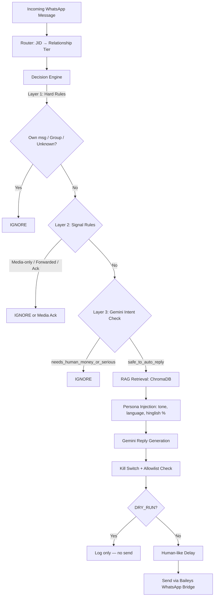

# WhatsApp Persona Automation

> 🚧 **Work in progress** — actively being built. Features and structure may change.

A retrieval-grounded WhatsApp persona agent that learns your texting style from real chat exports and generates contextually appropriate, persona-consistent replies using RAG + Gemini. It is not a chatbot — it is a personal style mirror that decides when to reply, crafts a reply that sounds like you, and sends it only when it is safe to do so.

---

## Architecture



---

## Setup

### 1. Environment variables

Copy `.env.example` to `.env` and fill in your key:

```bash
cp .env.example .env
```

```
GEMINI_API_KEY=your_gemini_api_key_here
FLASK_PORT=5050
AGENT_BRIDGE_PORT=5001
LOG_LEVEL=warn
```

Get a free Gemini API key at [aistudio.google.com](https://aistudio.google.com).

### 2. Python dependencies

> ⚠️ Install Python **for all users** (via the "Install for all users" checkbox in the installer) so compiled packages like `scipy` and `sentence-transformers` land in `C:\Program Files\` rather than `AppData`. This is required for Windows Application Control to allow them to load.

```bash
pip install google-genai chromadb sentence-transformers flask streamlit streamlit-autorefresh python-dotenv requests
```

### 3. Node dependencies

```bash
npm install
```

### 4. Add your WhatsApp chat exports

Export chats from WhatsApp (without media) and place the `.txt` files in `data/raw_export/`. Then parse and embed them:

```bash
python ingestion/parse_export.py --name "YourName"
python ingestion/embed_to_chroma.py
```

### 5. Update the relationship map

Edit `config/relationship_map.json` to map phone numbers to relationship tiers:

```json
{
  "_default": "unknown",
  "919812345670": "friend",
  "919812345671": "family",
  "919812345672": "professional"
}
```

Only numbers listed here (with a value that is not `"unknown"`) will receive auto-replies.

---

## Running the full stack

Open four terminal tabs and run one command in each, **in this order**:

**Tab 1 — ChromaDB vector store**
```bash
chroma run --path ./chroma_data --port 8000
```

**Tab 2 — Flask agent bridge**
```bash
python -m agent.bridge
```

**Tab 3 — Streamlit console**
```bash
streamlit run console/app.py
```
Open [http://localhost:8501](http://localhost:8501) in your browser.

**Tab 4 — Baileys WhatsApp client**
```bash
node whatsapp/baileys_client.js
```
On first run a QR code will appear — scan it with a **dedicated/secondary WhatsApp number** (not your main number). The session is saved to `auth_info_baileys/` so you only scan once.

> **Always start every fresh session in DRY_RUN mode** (the default). Use the console to verify replies look correct before switching to LIVE.

---

## Using the console

The Streamlit console at [http://localhost:8501](http://localhost:8501) gives you live control:

| Control | What it does |
|---|---|
| **Mode toggle** (DRY_RUN / LIVE) | DRY_RUN logs replies without sending. LIVE enables actual sending. Always start here. |
| **Reply delay** (min / max seconds) | Random human-like delay before each send. Defaults to 3–12 seconds. |
| **🔴 KILL SWITCH** | Creates `kill_switch.flag` in the repo root. All sending stops immediately across both Python and Node. Click "Clear kill switch" to resume. |
| **Live feed** | Shows every incoming message, the decision (REPLY / IGNORE), the reason, the generated reply, and an expandable retrieval trace. Auto-refreshes every 2 seconds. |

---

## ⚠️ USE RESPONSIBLY

> **Baileys automates WhatsApp Web, which is against WhatsApp's Terms of Service.**
> - Run only on a **dedicated or secondary phone number** — never your main personal number.
> - Keep volume low. Human-like delays are built in for a reason.
> - Reply only to contacts who have **explicitly consented** to receiving automated replies.
> - Aggressive or high-volume use can get the number **permanently banned**.
> - You are responsible for how you use this tool.

---

## Tech stack

| Layer | Tool |
|---|---|
| Language | Python 3.12+ / Node.js |
| LLM API | Google Gemini (free tier) |
| Vector DB | ChromaDB |
| Embeddings | sentence-transformers |
| WhatsApp Bridge | Baileys v6.7.22 |
| Dashboard | Streamlit |

---

Built by [@koustavdatascience](https://github.com/koustavdatascience) with [Kiro](https://kiro.dev)
